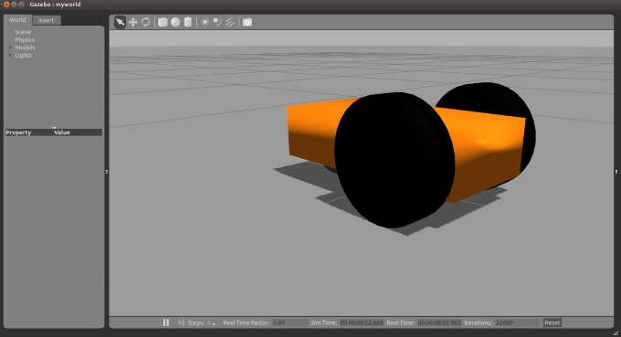

# mybot



## Instruction

I have written a blog to describe the detailed procedures of making the robot from scratch, and below is the link

[Making my own Autonomous Robot in ROS / Gazebo Day 1](http://www.cnblogs.com/casperwin/p/6258565.html)

### Run the Models

Load the Gazebo simulator in a terminal

```
roslaunch mybot_gazebo mybot_world.launch
```

## Reference

1. [Robotic simulation scenarios with Gazebo and ROS](http://www.generationrobots.com/blog/en/2015/02/robotic-simulation-scenarios-with-gazebo-and-ros/)
2. **Tutorial** [Getting Starting with Autonomous Robots in ROS via Simulations](http://moorerobots.com/2016/09/27/tutorial-getting-started-with-ros-simulations/)
